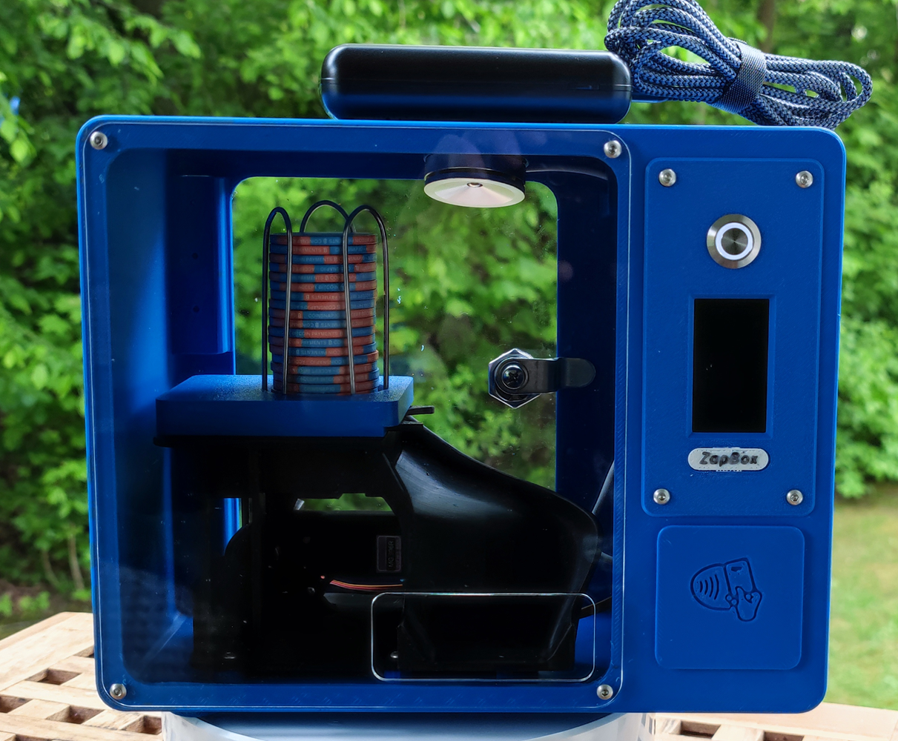
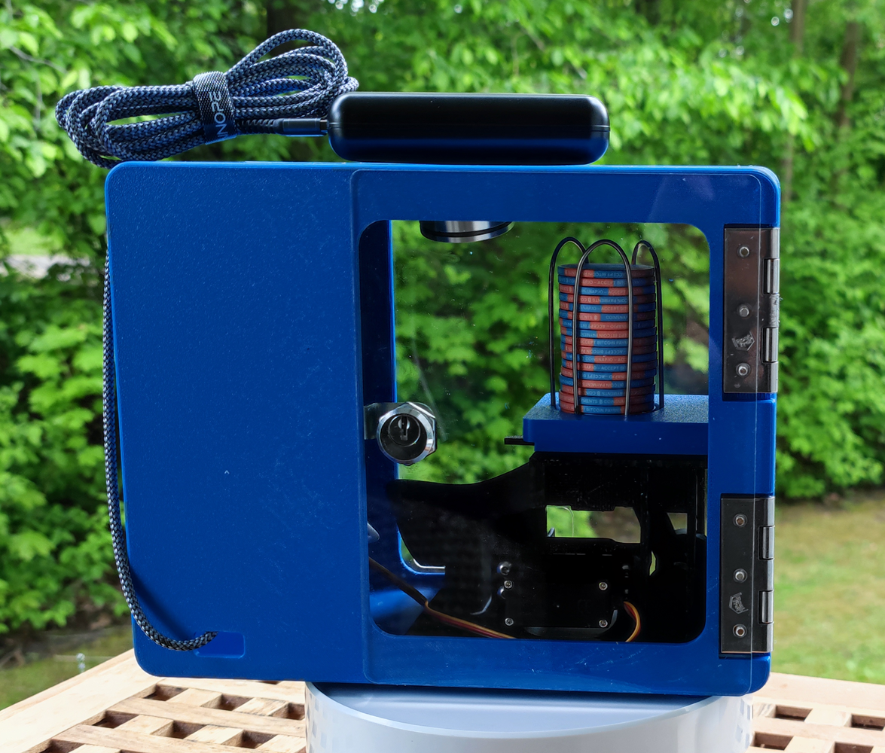

# Plebtap Coin Machine

A vending machine that dispenses physical coin-like discs — paid via integrated ZapBox.

| Front View | Back Side |
|:---:|:---:|
|  |  |

## See it in Action

*(Note: Some browsers might need a direct click on the file in the assets folder to play MP4)*

## What is this?

The Plebtap Coin Machine is a **mechanical/electronic vending machine** designed to dispense plastic discs that resemble coins or tokens. Payment is handled through an integrated **ZapBox** device.

Perfect for:
- Bitcoin events & meetups
- Physical bitcoin/tokens dispensing
- Collectible coin distribution
- Educational demonstrations

## Features

- Coin/disc dispensing mechanism
- ZapBox payment integration
- Parametric CAD design
- 3D-printable parts
- Modular assembly
- NFC payment support
- LED illumination

## 3D Printed Parts

All 3D printed parts fit on a **256 × 256 mm** print bed (Bambu Lab P2S).

| Part | Description |
|------|-------------|
| `spendergrundplatte` | Base plate of the dispenser |
| `coinschieber` | Coin pusher mechanism |
| `coinschiebeachse` | Pusher axle |
| `sockelplatte` | Bottom base plate |
| `lagerstock` | Bearing mount |
| `coinzwischenhebel` | Intermediate lever |
| `verbindungshebel-coinaut` | Connection lever |

## Mechanical Components

| Part | Specification | Source |
|------|---------------|--------|
| Servo MG996R | Standard RC servo | Model shop / online |
| Servo horn double | Included with servo | Servo accessory |
| Coindraht | Welding wire bent into bracket, Ø 2.3 mm | DIY from welding wire |
| 608-Bearing | Ball bearing 608 | Standard bearing |
| Hinge | ~60 mm height hardware store hinge | Hardware store |

## Electronics

| Component | Description | Search Term / Source |
|-----------|-------------|---------------------|
| ZapBox | Lightning Network payment device | [zapbox.space](https://zapbox.space) |
| NFC Module | PN532 NFC/RFID wireless module | AliExpress: "pn532 nfc rfid drahtloses modul" |
| LED Module | 5V LED spot lighting | AliExpress: "led beleuchtung spot 5v" |
| Mailbox lock | Standard mailbox lock | Hardware store |

## Laser Cut Parts

| Part | Material | Action |
|------|----------|--------|
| `rueckseitecoinomat` | Acrylic/Plexiglas sheet | Extract dimensions to DXF, send to laser cutting service |
| `tuercoinomat` | Acrylic/Plexiglas sheet | Extract dimensions to DXF, send to laser cutting service |

## File Formats

| File | Description |
|------|-------------|
| `plebtap-coin-machine.FCStd` | FreeCAD source file — fully parametric |
| `*.step` | STEP files — universal CAD exchange format |
| `*.stl` | STL files — ready for 3D printing |
| `*.dxf` | DXF files — for laser cutting services |

## Customization

Open `plebtap-coin-machine.FCStd` in [FreeCAD](https://www.freecad.org/) and adjust:

- **Machine dimensions** — height, width, depth
- **Disc size** — diameter and thickness of output coins
- **Hopper capacity** — how many discs it holds
- **Servo mounting** — position and angle of MG996R servo
- **ZapBox mount** — position of payment device

## Assembly Instructions

*(To be added)*

## License

This project is licensed under the **CERN-OHL-S-2.0** (CERN Open Hardware Licence Version 2 — Strongly Reciprocal).

See [LICENSE](LICENSE) for full terms.

## Contributing

Contributions welcome! Whether it's:
- Improved dispensing mechanism
- Alternative payment integrations
- Better documentation
- Assembly videos
- Photos of your build

See [CONTRIBUTING.md](CONTRIBUTING.md) for guidelines.

## Credits

- **Plebtap Coin Machine**: Created by [Sven / Plebtap](https://github.com/pleBtap)
- **ZapBox**: [Axel Hamburch](https://github.com/AxelHamburch) — [zapbox.space](https://zapbox.space/)
- [FreeCAD](https://www.freecad.org/) — Open source parametric 3D CAD
- [Bitcoin](https://bitcoin.org/) — The original cryptocurrency

---

⭐ Star this repo if you like it!