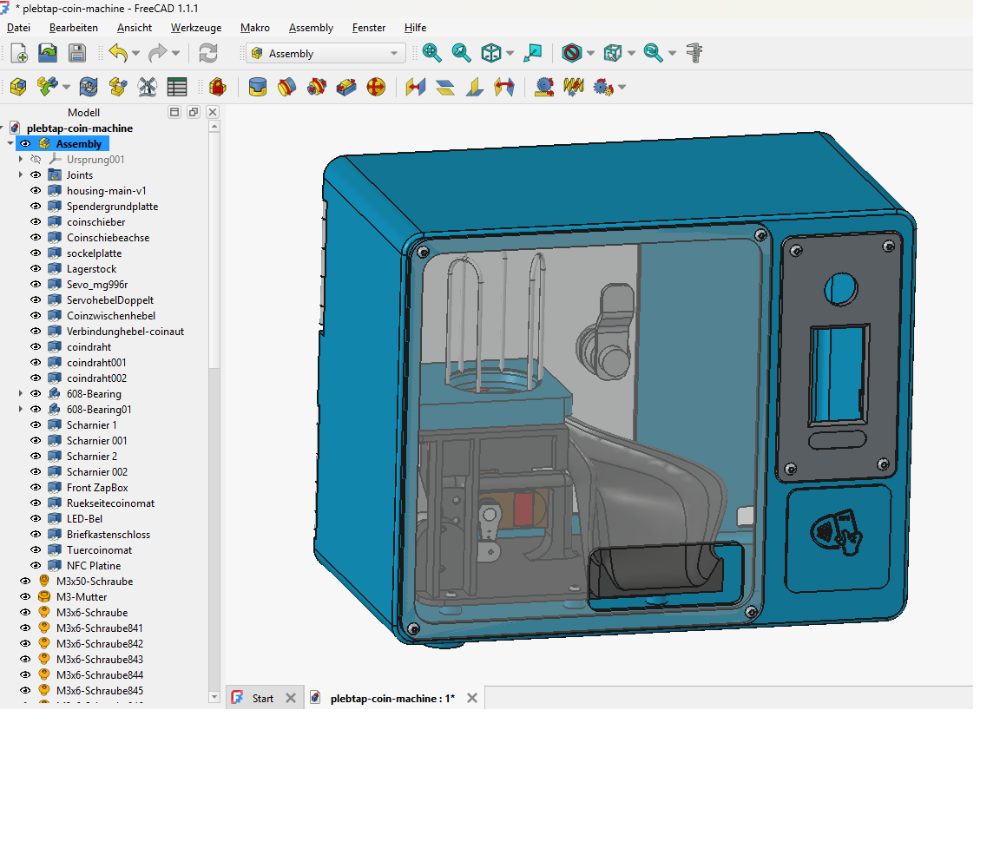

# Plebtap Coin Machine

A vending machine that dispenses physical coin-like discs — paid via integrated ZapBox.

## What is this?

The Plebtap Coin Machine is a **mechanical/electronic vending machine** designed to dispense plastic discs that resemble coins or tokens. Payment is handled through an integrated **ZapBox** device.

Perfect for:
- Bitcoin events & meetups
- Physical bitcoin/tokens dispensing
- Collectible coin distribution
- Educational demonstrations

## Features

- Coin/disc dispensing mechanism
- ZapBox payment integration
- Parametric CAD design
- 3D-printable parts
- Modular assembly

## ZapBox Integration

This project uses **[ZapBox](https://zapbox.space/)** — a Lightning Network payment device by [Axel Hamburch](https://github.com/AxelHamburch).

- **Website:** https://zapbox.space/
- **GitHub:** https://github.com/AxelHamburch/ZapBox

The ZapBox enables contactless Bitcoin/Lightning payments for the vending machine.

## File Formats

| File | Description |
|------|-------------|
| `plebtap-coin-machine.FCStd` | FreeCAD source file — fully parametric |
| `*.step` | STEP files — universal CAD exchange format |
| `*.stl` | STL files — ready for 3D printing |

## Customization

Open `plebtap-coin-machine.FCStd` in [FreeCAD](https://www.freecad.org/) and adjust:

- **Machine dimensions** — height, width, depth
- **Disc size** — diameter and thickness of output coins
- **Hopper capacity** — how many discs it holds
- **Dispensing mechanism** — mechanical or motorized
- **ZapBox mount** — position of payment device

## Bill of Materials (BOM)

| Item | Quantity | Notes |
|------|----------|-------|
| 3D printed parts | varies | See `bom/` folder |
| Stepper motor | 1 | For dispensing mechanism |
| Bearings | 4 | 608ZZ or similar |
| M3 screws | assorted | Various lengths |
| [ZapBox](https://zapbox.space/) | 1 | Payment integration |

## Assembly Instructions

*(To be added)*

## License

This project is licensed under the **CERN-OHL-S-2.0** (CERN Open Hardware Licence Version 2 — Strongly Reciprocal).

See [LICENSE](LICENSE) for full terms.

## Contributing

Contributions welcome! Whether it's:
- Improved dispensing mechanism
- Alternative payment integrations
- Better documentation
- Assembly videos
- Photos of your build

See [CONTRIBUTING.md](CONTRIBUTING.md) for guidelines.

## Credits

- **Plebtap Coin Machine:** Created by [Sven / Plebtap](https://github.com/pleBtap)
- **ZapBox:** [Axel Hamburch](https://github.com/AxelHamburch) — [zapbox.space](https://zapbox.space/)

## Related Projects

- [FreeCAD](https://www.freecad.org/) — Open source parametric 3D CAD
- [ZapBox](https://github.com/AxelHamburch/ZapBox) — Lightning payment device
- [Bitcoin](https://bitcoin.org/) — The original cryptocurrency

---

⭐ Star this repo if you like it!