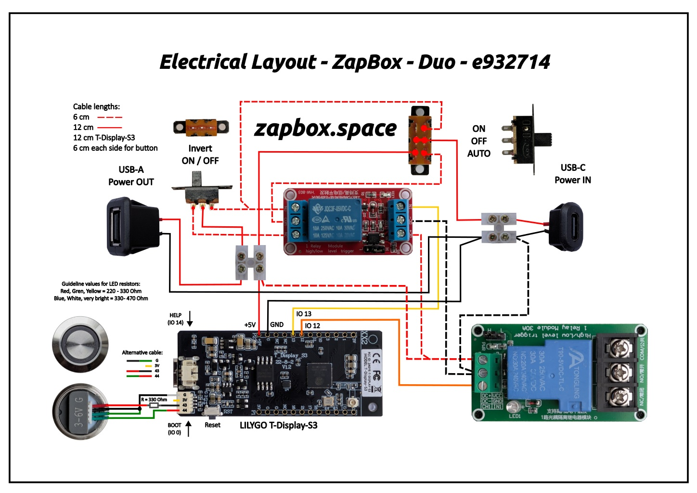

# Electronics & Wiring

The Plebtap Coin Machine is powered by a **ZapBox** for payment processing and an optional microcontroller for the dispensing mechanism.

## Core Components

### 1. Payment Integration (ZapBox)
The heart of the payment system is the ZapBox, developed by Axel Hamburch. It handles Bitcoin/Lightning payments and triggers the dispensing mechanism.

- **Official Website:** [zapbox.space](https://zapbox.space)
- **Source Code & Documentation:** [GitHub: AxelHamburch/ZapBox](https://github.com/AxelHamburch/ZapBox)

### 2. Dispensing Mechanism
- **Servo:** MG996R (Standard High-Torque RC Servo)
- **NFC Module:** PN532 NFC/RFID controller
- **Lighting:** 5V LED Spot (AliExpress)

## Wiring Overview

*(See the assets folder for detailed photos of the wiring)*

### Connections
- The **MG996R Servo** is controlled via PWM.
- The **PN532 NFC Module** is typically connected via I2C or SPI (depending on your ZapBox/Controller configuration).
- Power is supplied via **5V USB/External Power Supply**.

---

For detailed pinouts and firmware configuration, please refer to the [ZapBox Documentation](https://github.com/AxelHamburch/ZapBox).